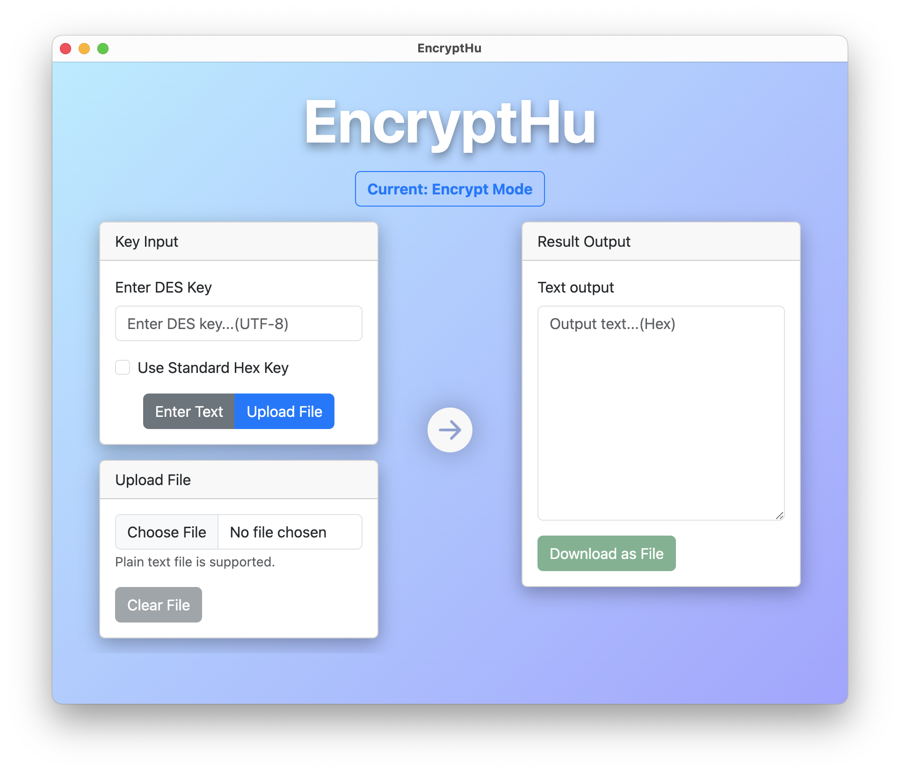
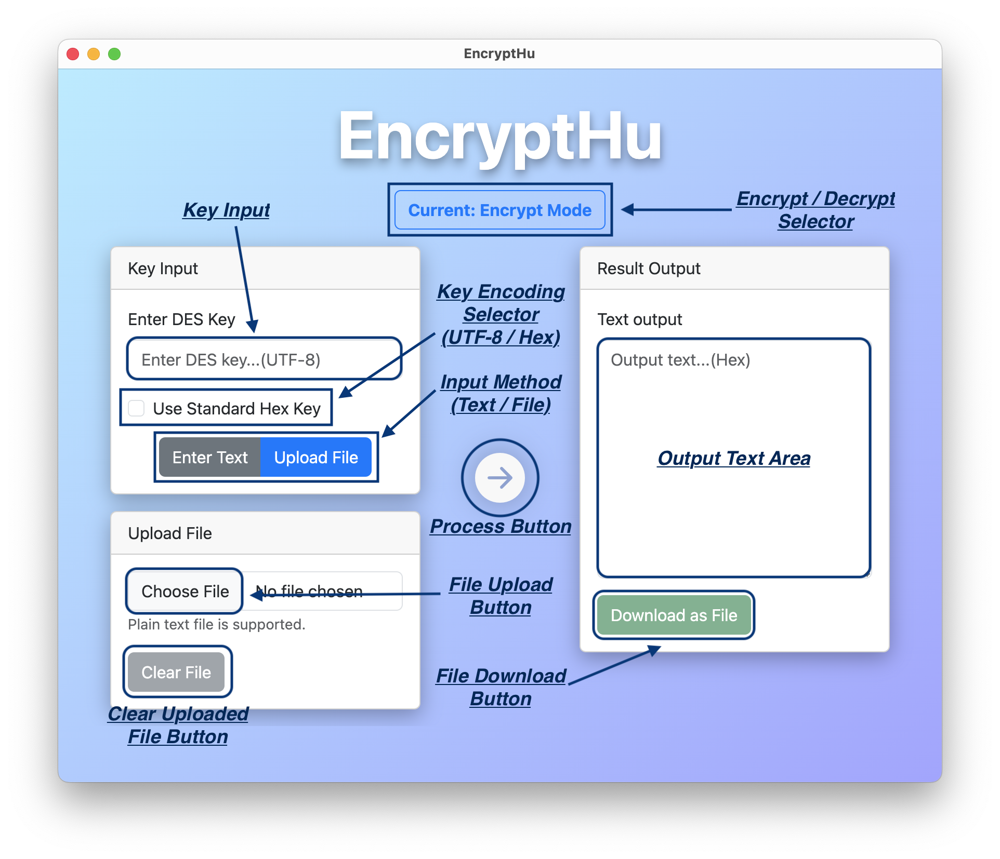

# Report for DES Encryption and Decryption Tool - EncryptHu


## Introduction

### Background on DES

The Data Encryption Standard (DES) is a symmetric-key block cipher that was once widely used in data encryption. Published by the National Institute of Standards and Technology in 1977, DES played a crucial role in promoting the growth of modern cryptography. It encrypts and decrypts data in 64-bit blocks using a 56-bit key. Though superseded by more secure algorithms due to its vulnerability to brute-force attacks, DES remains an important reference in the study of cryptography.

### Purpose of the Report

This report aims to provide a comprehensive understanding of the **EncryptHu** application, which facilitates DES encryption and decryption. It offers a deep dive into the application's architecture, usage, and underlying logic, ensuring clarity for users.

## Overview of EncryptHu

### Technologies Used: Electron and Bootstrap

The application leans on Electron, a robust framework for building cross-platform desktop apps using web technologies. Electron ensures that **EncryptHu** is platform-independent, running seamlessly on various operating systems. Complementing Electron, Bootstrap—a popular HTML, CSS, and JavaScript framework—lends the app a contemporary aesthetic. The combination ensures both functional and visual wellness.

### Features

#### Support for flexible text and file input

Whether a quick text snippet or an entire text file, **EncryptHu** is equipped to handle varying data forms. A user can encrypt/decrypt via text input, or file upload. 

#### DES encryption with flexible keys option

Beyond just the standard DES encryption, the application grants users the flexibility to use keys without placing any restriction on length, or encoding of keys. To meet various needs, the user can choose to use standard 64-bit DES key in Hex form. 

#### Error Detection - Invalid Key and Corrupted Ciphertext Detection

**EncryptHu** detects if the provided DES key is invalid or if the ciphertext does not conform to the PKCS5 padding standard. Immediate feedback alerts the user, ensuring only valid data and keys are processed, maintaining data integrity and security. When meeting the corruped ciphertext situation, raw data is showed to help user.

#### User-friendly & modern interface

With a priority on user experience, the interface is both intuitive and sleek. The integrated Bootstrap design guarantees a modern look, while the organized card layout ensures ease of navigation.

## Installation Process

To get **EncryptHu** up and running on your local machine, a simple installation process has been devised. Here's a step-by-step guide:

(Note: Before initiating the installation process, ensure you have Node.js and npm installed on your machine.)

1. **Clone the Repository**: *(Skip if already have code downloaded and extracted)* Start by cloning the source code from the online repository. This can be done using the following command:
```bash
git clone https://github.com/hudsonhu/EncryptHu.git
```

2. **Navigate to the Project Directory**: Once the repository is cloned, the next step is to navigate to the project directory. Use the command:
```bash
cd EncryptHu
```

3. **Install Dependencies**: Being built with Electron and Bootstrap, **EncryptHu** requires certain dependencies to function optimally. These dependencies can be installed using the Node Package Manager (npm) as follows:
```bash
npm install
```

4. **Run the Application**: With all dependencies installed, the application is ready to launch. Run the application with the command:
```bash
npm run start
```

Post these steps, the application will launch, and you'll be greeted by the **EncryptHu** interface, ready for encryption and decryption tasks.

## Usage Guidelines

Understanding how to properly utilize **EncryptHu** ensures efficient and accurate encryption and decryption processes. The user interface of application shows like this:



Here are the components break down:




### Choosing Between Encryption and Decryption Modes

Upon launching **EncryptHu**, users are presented with an option to toggle between encryption and decryption modes. This can be done using the switch located at the top of the interface. The mode will determine whether the input data will be encrypted or decrypted based on the provided key.

### DES Key Entry and Option for Standard Hex Key

The application provides a designated section labeled "Key Input". Here, users can manually enter the DES key. If users wish to employ a standard hex format key, they can check the "Use Standard Hex Key" option located below the key input field.

### Input Type Selection: Text or File

Depending on the user's needs, **EncryptHu** provides flexibility for data input. Users can either directly type in the text they want to encrypt/decrypt or upload a file containing the data. This choice can be made using the buttons "Enter Text" or "Upload File".

### Providing Input Data

- **For Text**: Use the textarea under the "Enter Text" section to type in or paste the text data. 
- **For Files**: Click on the "Upload File" button to open the file explorer and choose the desired file. The application currently supports plain text files.

### Encrypting or Decrypting

Once the data and key are in place, click on the arrow button in the center of the interface. This will initiate the encryption or decryption process based on the chosen mode and the data provided.

### Viewing and Downloading Results

Post the encryption or decryption process, the result will be displayed in the "Result Output" section. Users can view the output in the designated textarea. Additionally, for convenience, there's an option to download the result as a file by clicking the "Download as File" button.

Following these guidelines ensures that users can quickly and effectively use **EncryptHu** for their encryption and decryption needs, capitalizing on the application's features and capabilities.

## Deep Dive into DES Implementation (`des.js`)

The `des.js` file is the heart of **EncryptHu**, containing the core logic for DES encryption and decryption. Let's break down the integral parts of the DES algorithm as implemented in this module:

### Constants and Initial Setup

At the beginning of the `des.js` file, several constants such as `IP`, `IP_INV`, `PC1`, `PC2`, `P`, `E`, and `S` are imported from `constants.js`. These constants are tables used for various bit permutations and substitutions, essential for DES's functionality.

### Key Generation

#### Initial Permutation and Splitting

Upon receiving the 64-bit key, it undergoes an initial permutation using the `PC1` table, effectively reducing it to 56 bits. This permuted key is then split into two equal halves, `C` and `D`.

#### Generating 16 Subkeys

For the encryption and decryption processes, 16 unique subkeys are derived from the original key. Each subkey is 48 bits long. The `generateSubkeys` function handles this by performing specified rotations on `C` and `D` for each round and then combining and permuting them using the `PC2` table to obtain the subkeys.

### Bitwise Operations

Several bitwise operations are fundamental to DES:

#### Permutation

The `permute` function is used throughout the DES algorithm to rearrange bits according to a specified permutation table.

#### Rotation

Bit rotation is crucial for key generation. The `rotateLeft` function achieves this by shifting bits to the left by a specified count.

#### XOR Operation

The `xor` function computes the bitwise XOR of two blocks. It's instrumental in both the encryption and decryption processes.

### Encryption

#### Initial Permutation of Plaintext

Before undergoing the 16-round transformation, the plaintext is permuted using the `IP` table.

#### 16 Rounds of Transformation

For each of the 16 rounds, the plaintext undergoes a series of bitwise operations, substitutions, and permutations. The `iterate_16` function controls this logic.

#### Combining Results

Post the 16 rounds, the results are concatenated and undergo a final permutation using the `IP_INV` table, yielding the encrypted text.

### Decryption

#### Steps and Logic

The decryption process is essentially the inverse of encryption. The ciphertext undergoes an initial permutation, followed by the 16-round transformation (with the subkeys applied in reverse order), and concludes with a final permutation.

### Utility Functions

Apart from the core DES functions, `des.js` also offers several utility functions:

#### Hex to Binary Conversion

The `hexToBinary` function aids in converting hexadecimal strings to their binary representation, essential for the DES algorithm that operates on binary data.

#### Binary to Hex Conversion

The `binaryToHex` function reverses the above process, converting binary data back to its hexadecimal representation.

#### Key and Data Validation

Both `validateKey` and `validateData` ensure the provided key and data adhere to DES's requirements.

#### Padding Mechanisms: PKCS5

Since DES works on 64-bit blocks, it's necessary to ensure data is a multiple of this size. The `pkcs5Pad` and `pkcs5Unpad` functions handle padding and unpadding of data, respectively, ensuring data integrity.

This in-depth exploration of the `des.js` module provides clarity on the intricacies of the DES encryption and decryption logic within **EncryptHu**. The effective combination of these functions ensures data security and precision in the encryption process. 

## User Interface (`index.html`)

The user interface is the primary point of interaction between the end-users and the **EncryptHu** application. This interface has been meticulously designed to ensure a seamless user experience while maintaining a modern aesthetic appeal. Here’s a detailed examination:

### Design Overview

**EncryptHu** sports a clean and intuitive design that aids users in effortlessly navigating through its features. The application's layout is divided into two main sections – the input area on the left and the result output on the right.

### Input and Output Areas

The input area is where users input their data and the corresponding DES key. It facilitates both text and file inputs, granting flexibility based on the user's needs. This section also houses the key input, where users can enter the DES key and opt for a standard hex key format.

The result output, on the other hand, displays the encrypted or decrypted results. It provides users with a clear and organized view of the output, further enhanced with a download option for added convenience.

### Interactivity Elements: Buttons, File Uploaders, and Text Areas

- **Toggle Switch**: Positioned at the top, this switch allows users to seamlessly toggle between encryption and decryption modes.
  
- **Key Input & Checkbox**: Below the toggle, users can input the DES key. A checkbox enables the option to use a standard hex key.
  
- **Input Mode Selector**: Two buttons labeled "Enter Text" and "Upload File" let users choose their preferred input method.
  
- **Textarea & File Upload**: Depending on the chosen input method, users can either type/paste text or upload a file.
  
- **Arrow Button**: This central button initiates the encryption or decryption process, acting as the bridge between input and output.
  
- **Output Textarea & Download Button**: The results of the encryption/decryption are displayed in a textarea. A button below this area provides the option to download the results as a file.

## Conclusion

### Summary of the Project

**EncryptHu** stands as a testament to the successful implementation of the DES encryption and decryption algorithm within a user-friendly interface. The project's primary aim was to simplify the complex world of cryptography, making it more accessible and straightforward for end-users. By combining the robustness of the DES algorithm with the ease-of-use of Electron and the visual appeal of Bootstrap, **EncryptHu** achieves this goal commendably.

From the core DES functionalities housed in the `des.js` to the intuitive interface detailed in the `index.html`, every facet of **EncryptHu** has been crafted with the user in mind. The application not only encrypts and decrypts data efficiently but also ensures the entire process, from data input to result output, is seamless.

### Potential Improvements and Future Work

While **EncryptHu** has accomplished much, there's always room for enhancement:

- **Incorporation of Advanced Algorithms**: Given DES's known vulnerabilities, integrating more advanced encryption algorithms like AES or RSA could amplify the application's security prowess.
  
- **Optimization for Larger Files**: Improving efficiency for encrypting and decrypting large files can enhance user experience further.

In conclusion, **EncryptHu** has set a strong foundation as a reliable encryption and decryption tool. With potential upgrades and improvements, it promises to be an invaluable asset in the realm of data security.

## References

[1] *Data Encryption Standard (DES)* by NIST, FIPS PUB 46-3, October 25, 1999 (Reaffirmed), Available at: https://csrc.nist.gov/CSRC/media/Publications/fips/46/3/archive/1999-10-25/documents/fips46-3.pdf